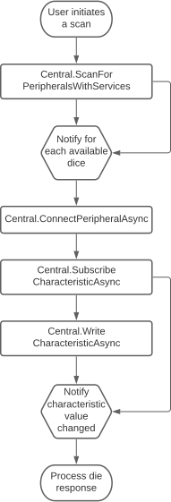

# PixelsUnityPlugin

This is the Pixels plugin for Unity, a Unity asset that enables communications between
Pixels and your device dice using Bluetooth Low Energy.

The following platforms are currently supported: Windows 10 and above, iOS and Android.

The development is done using Unity 2020.3.
It should work just as well on all Unity version since 2018. Please open a ticket in
GitHub if you're having issues.

## Overview

Bluetooth access is not available within Unity so this asset is relying on native
plugins to get a direct access to the specific Bluetooth APIs for each supported
platform.

The Unity implementation is documented below while the plugins are described in the
[dedicated](#native-plugins) section.

On the managed side, there are two main classes available to the Unity programmer.

Interacting with Bluetooth Low Energy devices (usually referred to as peripherals)
happens in two steps.
First there is scanning which discovers available peripherals in the vicinity, and
second there is the connection.

One connected to a peripheral, the software may start to discover its capabilities and
exchange data back and forth.
A major pain point when working with wireless devices is that they may get disconnected
at any moment, for a host of reasons (the peripheral was moved out of reach, it ran out
of battery, interferences prevented the flow of communication to get through properly,
etc.).

### NativeInterface

The raw functionality of the native plugins is exposed through the _NativeInterface_
static class. Callbacks from the native implementation such as for scanning, connection
events or requests responses may run on any thread.

User code also has to manage the lifetime of native resources.
And finally available features and behavior will vary depending on the platform it's
running on.

### Central

On the other hand, the _Central_ static class wraps _NativeInterface_ with a design
tailored towards Unity.
All Bluetooth requests return a Unity coroutine. Connection and scanning events are
managed by the class and are notified to the user code on the main thread during the
frame update.

Native resources are also managed by this class and it tries to make the behavior as
consistent as possible across the different platforms.

### Pixel

While those classes allow for a generic access to Bluetooth Low Energy peripherals,
we will soon add new classes dedicated to the communications with Pixels dice.

## Architecture

### Main classes

Native plugins have each a different way of binding with Unity C# code.

Windows and iOS plugins must expose C functions that are manually bound to C# static
methods. Together those C functions form an API which was developed specifically to be
used from Unity.
They respectively make use of the C++ and Objective-C classes of the plugins

For Android plugins, Unity offers C# proxy classes that automatically bind to Java
classes, so there is no need to build a specific API for Unity.

Each native plugin has a C# {_PlatformName_}NativeInterfaceImpl class counterpart
in Unity. They handle all the requirements for achieving proper code and data
marshaling (which is the exchange of data and code flow between plugins and Unity)
for their platform.

The _NativeInterface_ static class exposes a single interface to the Unity developer.
It instantiates the correct {_PlatformName_}NativeInterfaceImpl at runtime and simply
forwards calls to it.

Bluetooth scanning results are returned in JSON format by the plugins. The Unity JSON
library is used for parsing the JSON data into a _NativeAdvertisementDataJson_ instance,
which content is then stored in a _ScannedPeripheral_ instance.

The later represents a Bluetooth Low Energy (BLE) peripheral that was scanned at a
certain point in time.
It must be used by the software to identify a specific peripheral when trying to connect
to one, whether using the _NativeInterface_ or the _Central_ classes.

The chart below shows those different layers:

### Execution flow between plugins and C# code

The chart below presents the execution flow of code when connecting to a peripheral.

The connect method of _Central_ (or _NativeInterface_) is called by the software. It
takes an instance of a _ScannedPeripheral_ as an argument. The call is then forwarded
to the appropriate {_PlatformName_}NativeInterfaceImpl instance which handles the
technical details of marshaling it to the native plugin.

When running on Windows or iOS, the C connect function is called through marshaling, which
in turn retrieves the correct C++ _Peripheral_ or Objective-C _SGBlePeripheralQueue_
instance and calls its connect method.

When running on Android, the Java _Peripheral_ class is directly retrieved in C# and its
connect method is invoked from Unity.

Connecting to a peripheral and most other BLE requests are asynchronous. While such calls
return almost immediately, the Operating System continues processing the request on a
background thread and runs a callback to notify of its outcome.

Such callbacks are then processed by the native code and forwarded back to the C# code
through marshalling. Finally the proper C# handler is then invoked with the request result.

### Basic sequence of BLE operations

When dealing with BLE peripherals and specifically Pixels, one may want to subscribe to
events to get notified of a state change (like a die being rolled).

The chart below shows the different steps to achieve that.

The software must scan for peripherals to identify which one to connect to. A Pixel dice
advertise specific BLE services and thus can be easily filtered out during a scan.

Once a die is found, the software may connect to it. Upon success it can subscribe to
the characteristic (a BLE communication channel) that notifies of rolling dice events.

It may also write to another characteristic to send messages to the die.

When the die is rolled (or upon other events), the characteristic value (its data) is
changed to reflect that even. The software being subscribed to it, it is then notified
of this change and can process the event. 

## Native Plugins

Each native plugin implements classes that offer a simplified access to the Bluetooth
Low Energy features.
Those classes are designed to be as consistent as possible across the different platforms
while still staying true to their platform specific APIs and coding style.

This makes it possible to both have a similar workflow for the different platforms while
still retaining access to some of their unique features.

See the [Modules](modules.html) documentation to get a more in depth description of the
[Windows](group___win_r_t___cpp.html),
[iOS](group___apple___objective-_c.html) and
[Android](group___android___java.html) native implementations.