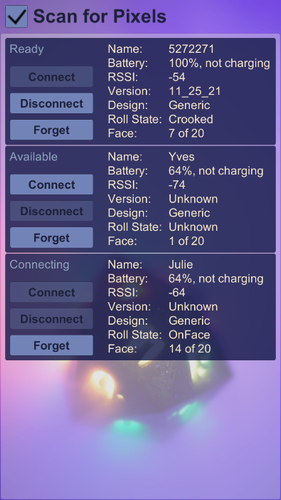
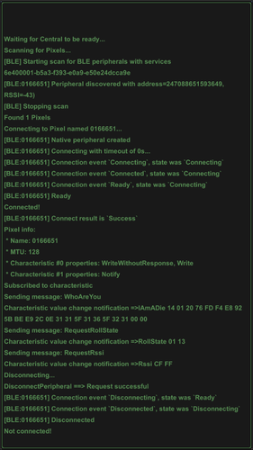
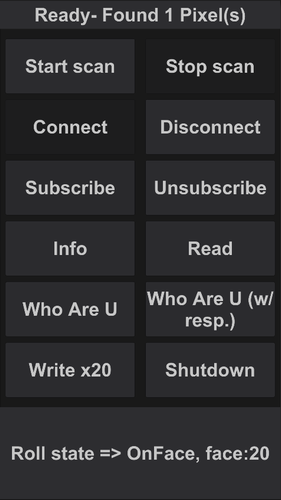
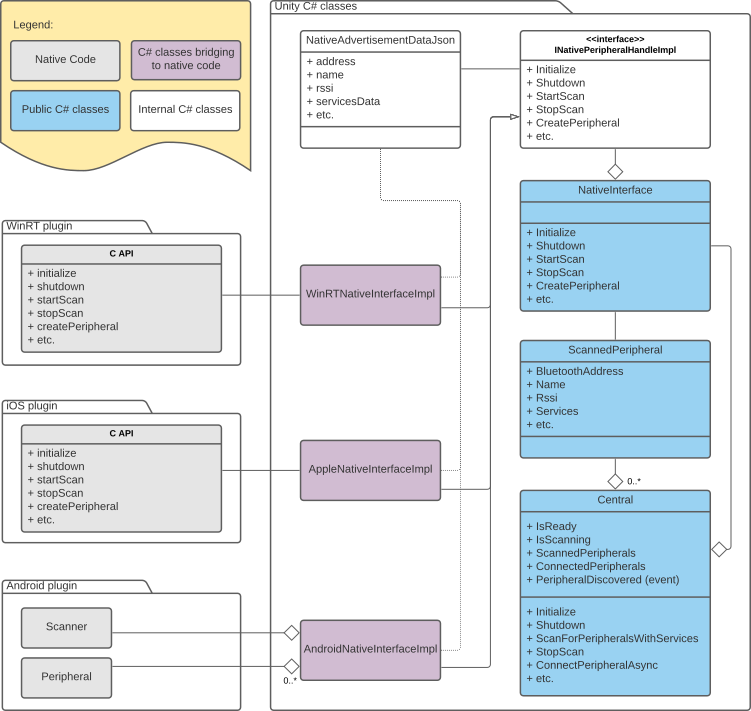
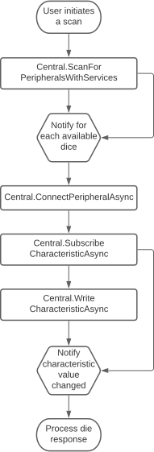
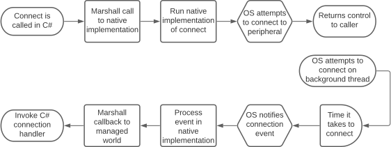

# PixelsUnityPlugin

This is the Pixels plugin for Unity, a Unity Asset that enables communications between
Pixels dice and a smartphone or a computer using Bluetooth Low Energy.

The following platforms are currently supported: Windows 10 version 1709 (Fall Creators
Update) and above, iOS and Android. MacOS support will be added next.

The development of this plugin is made using Unity 2020.3.
It should work just as well on all Unity version since 2018.

## Foreword

Pixels are full of LEDs, smarts and no larger than regular dice, they can be
customized to light up when and how you desire.
Check our [website](https://gamewithpixels.com/) for more information.

> **Warning**
> Before jumping into programming please make sure to read our Pixels developer's
> [guide](https://github.com/GameWithPixels/.github/blob/main/doc/DevelopersGuide.md).

Please open a [ticket](https://github.com/GameWithPixels/PixelsUnityPlugin/issues)
on GitHub if you're having any issue.

## Overview

Bluetooth access is not available in Unity so our implementation is relying on native
plugins (also included) to get a direct access to the Bluetooth Low Energy APIs for
each supported platform.

Accessing Bluetooth Low Energy devices (usually referred to as peripherals) happens in
two steps.
First there is scanning which discovers available peripherals in the vicinity, and
second there is a connection attempt.

One connected to a peripheral, the software may start to query for its capabilities and
exchange data back and forth with the peripheral.
When developing software connecting to Bluetooth devices such as Pixel dice, the code
need to account for disconnection events that may happen at any moment and
for a variety of reasons: the peripheral was moved out of reach, it ran out of battery,
interferences prevented the flow of communication to get through properly, etc.

This library aims to provide different levels of abstraction layers communicate with
Bluetooth Low Energy peripherals from Unity.
The highest level of abstraction layer offers a simplified access to the most useful
Pixels features whereas the lowest level layer allow for a direct and generic access to
most Bluetooth Low Energy features.

The main classes available from Unity are introduced below.
For more details about their implementation or the native plugins, please refer to the Doxygen
generated code [documentation](https://gamewithpixels.github.io/PixelsUnityPlugin/modules.html).
Following [Doxygen](https://www.doxygen.nl) semantics, the documentation is divided in "modules":
- The [Unity Asset](https://gamewithpixels.github.io/PixelsUnityPlugin/group___unity___c_sharp.html)
C# code
- The [WinRT DLL plugin](https://gamewithpixels.github.io/PixelsUnityPlugin/group___win_r_t___cpp.html)
written in C++
- The [iOS plugin](https://gamewithpixels.github.io/PixelsUnityPlugin/group___apple___objective-_c.html)
written in Objective-C
- The [Android plugin](https://gamewithpixels.github.io/PixelsUnityPlugin/group___android___java.html)
written in Java

## Unity classes

This section introduces the main classes available from Unity.

### NativeInterface

The raw functionality of the native plugins is accessible through the
[_NativeInterface_](https://gamewithpixels.github.io/PixelsUnityPlugin/class_systemic_1_1_unity_1_1_bluetooth_l_e_1_1_native_interface.html)
static class. Callbacks from the native implementation such as for scanning, connection
events or requests responses may run on any thread.
Also user code has to manage the lifetime of native resources.

Available features and behavior may vary depending on the platform or device it's running on.

### Central

On the other hand, the
[_Central_](https://gamewithpixels.github.io/PixelsUnityPlugin/class_systemic_1_1_unity_1_1_bluetooth_l_e_1_1_central.html)
static class wraps _NativeInterface_ with a design tailored for Unity.
All asynchronous Bluetooth requests return a enumerator (coroutine) that can be
run as a coroutine by Unity.
Connection and scanning events are managed by the static class and are notified to the
user code on the main thread during frame updates.

Native resources are also managed by _Central_ and it tries to account for differences
between the different platforms.

### Pixel

While the above classes implement a generic access to any Bluetooth Low Energy
peripheral, there are several Pixel specific types in the
[_Systemic.Unity.Pixels_](https://gamewithpixels.github.io/PixelsUnityPlugin/namespace_systemic_1_1_unity_1_1_pixels.html)
namespace.

The
[_Pixel_](https://gamewithpixels.github.io/PixelsUnityPlugin/class_systemic_1_1_unity_1_1_pixels_1_1_pixel.html)
class has many properties and methods to communicate with Pixel dice.

Also the
[_DiceBag_](https://gamewithpixels.github.io/PixelsUnityPlugin/class_systemic_1_1_unity_1_1_pixels_1_1_dice_bag.html)
static class implements methods for scanning for and connecting to Pixels.

#### Pixel messages

See the
[_Messages_](https://gamewithpixels.github.io/PixelsUnityPlugin/namespace_systemic_1_1_unity_1_1_pixels_1_1_messages.html) 
sub-namespace.

#### LED animations data

Animations let you customize how a Pixel dice will light up.
There is a wide spectrum of possibilities, from a simple flash of colors to
a rainbow effect, or more advanced effects such as waterfall, rotating rings, etc.

See the
[_Animations_](https://gamewithpixels.github.io/PixelsUnityPlugin/namespace_systemic_1_1_unity_1_1_pixels_1_1_animations.html)
sub-namespace.

#### LED animations profiles

Profiles define when and how your dice will light up.
A profile is made up of a list of rules. Each rule associates an event
(for example roll is equal to 1, or dice is picked up) with an action such as
playing an animation on the die or an audio clip in the app.

See the
[_Profiles_](https://gamewithpixels.github.io/PixelsUnityPlugin/namespace_systemic_1_1_unity_1_1_pixels_1_1_profiles.html)
sub-namespace.

## Examples

The example scenes for Unity are located in the `Assets/Systemic/Examples` folder
and the scripts they use are in the
[Systemic.Unity.Examples](https://gamewithpixels.github.io/PixelsUnityPlugin/namespace_systemic_1_1_unity_1_1_examples.html)
namespace.

### Pixels Demo

This application demonstrates how to scan for, connect to and retrieve information
from Pixel dice using the dedicated
[_Pixel_](https://gamewithpixels.github.io/PixelsUnityPlugin/class_systemic_1_1_unity_1_1_pixels_1_1_pixel.html)
and
[_DiceBag_](https://gamewithpixels.github.io/PixelsUnityPlugin/class_systemic_1_1_unity_1_1_pixels_1_1_dice_bag.html)
classes.

See the
[_PixelController_](https://gamewithpixels.github.io/PixelsUnityPlugin/class_systemic_1_1_unity_1_1_examples_1_1_pixel_controller.html)
and the
[_UIPixelPanel_](https://gamewithpixels.github.io/PixelsUnityPlugin/class_systemic_1_1_unity_1_1_examples_1_1_u_i_pixel_panel.html)
classes documentation.

### Console Application

This application runs a series of Bluetooth requests and outputs the console logs
onto the screen.

It demonstrates scanning for Pixel dice, connecting to one of them, retrieving
information from it, sending messages and getting notifications using the device
agnostic
[_Central_](https://gamewithpixels.github.io/PixelsUnityPlugin/class_systemic_1_1_unity_1_1_bluetooth_l_e_1_1_central.html)
class.

More details are available with the
[_BleConsole_](https://gamewithpixels.github.io/PixelsUnityPlugin/class_systemic_1_1_unity_1_1_examples_1_1_ble_console.html)
class documentation.

### Test Pad Application

This application let the user run various Bluetooth operations on a Pixel dice.

One may scan for Pixels, connect to one, retrieve information from and send messages
to it using the device agnostic
[_Central_](https://gamewithpixels.github.io/PixelsUnityPlugin/class_systemic_1_1_unity_1_1_bluetooth_l_e_1_1_central.html)
class.

More details are available with the
[_BleController_](https://gamewithpixels.github.io/PixelsUnityPlugin/class_systemic_1_1_unity_1_1_examples_1_1_ble_controller.html)
class documentation.

## Architecture

This part of the documentation covers in more technical details the structure of the
Unity Asset.

### Main classes

The native plugins have each a different way of binding to Unity C# code.

Windows and iOS plugins must expose C functions that are manually bound to C#
static methods. Together those C functions form an API which is exist specifically
to be used from Unity.
They make use of the C++ and Objective-C classes of their respective plugins

For Android plugins, Unity offers C# proxy classes that automatically bind to Java
classes, so there is no need to build an API specific for Unity.

Each native plugin has a C# {_PlatformName_}NativeInterfaceImpl class counterpart
in Unity. They handle all the requirements for achieving proper code and data
marshaling (which is the exchange of execution flow and data between plugins and Unity)
for their platform.

The _NativeInterface_ static class gives a single entry point to the plugins
functionalities for the Unity developer regardless of the platform.
It instantiates the correct {_PlatformName_}NativeInterfaceImpl at runtime and simply
forwards calls to it.

Bluetooth scanning results are returned in JSON format by the plugins. The Unity JSON
library is used for parsing the data into a _NativeAdvertisementDataJson_ instance,
which content is then stored in a
[_ScannedPeripheral_](https://gamewithpixels.github.io/PixelsUnityPlugin/class_systemic_1_1_bluetooth_l_e_1_1_scanned_peripheral.html)
instance.

The later represents a Bluetooth Low Energy (BLE) peripheral that was scanned at a
certain point in time.
It is then used by the software to identify a specific peripheral when trying to connect
to one, whether using the _NativeInterface_ or the _Central_ classes.

The chart below shows those different layers:

### Subscribing to Pixel events

When dealing with Bluetooth Low Energy (BLE) peripherals and specifically Pixels, one
may want to subscribe to events for being notified of a state change (like a die being
rolled).

The chart below shows the workflow of subscribing to Pixels events and reading their
associated data.

The software must first scan for peripherals to identify which one to connect to.
A Pixel dice advertise specific BLE services and thus can be easily filtered out during
a scan.

Once a die is found, the software may connect to it. Upon success it can subscribe to
the characteristic (a BLE communication channel) that notifies of rolling dice events.

It may also write to another characteristic to send messages to the die and, for example,
request its current state (which face is up, battery level, etc.).

When the die is rolled (or upon other events), the characteristic value (its data) is
changed to reflect that event. The software is the notified of this change through the
subscription and can process the event data accordingly.

### Execution flow between plugins and C# code

The chart below presents the execution flow of code when connecting to a peripheral.

The connect method of _Central_ (or _NativeInterface_) is called by the software. It
takes an instance of a _ScannedPeripheral_ as an argument. The call is then forwarded
to the appropriate {_PlatformName_}NativeInterfaceImpl instance which handles the
technical details of marshaling it to the native plugin.

When running on Windows or iOS, the C connect function is called through marshaling,
which in turn retrieves the correct C++ _Peripheral_ or Objective-C _SGBlePeripheralQueue_
instance and calls its connect method.

When running on Android, the correct Java _Peripheral_ object is directly retrieved in C#
and its connect method is invoked from Unity.

Connecting to a peripheral and most other BLE requests are asynchronous. While such calls
return almost immediately, the Operating System continues processing the request on a
background thread and execute a callback to notify of its outcome.

Such callbacks are then processed by the native code and forwarded back to the C# code
through marshalling. Finally the proper C# handler is invoked with the request result.

### Native Plugins

Each native plugin implements classes that offer a simplified access to Bluetooth Low
Energy features.
Those classes are designed to be as consistent as possible across the different platforms
while still staying true to their platform specific APIs and coding style.

This makes it possible to both have a similar workflow for the different platforms while
retaining access to some of their unique features.

See the
[Modules](https://gamewithpixels.github.io/PixelsUnityPlugin/modules.html)
documentation to get a more in depth description of the
[Windows](https://gamewithpixels.github.io/PixelsUnityPlugin/group___win_r_t___cpp.html),
[iOS](https://gamewithpixels.github.io/PixelsUnityPlugin/group___apple___objective-_c.html)
and
[Android](https://gamewithpixels.github.io/PixelsUnityPlugin/group___android___java.html)
native implementations.
